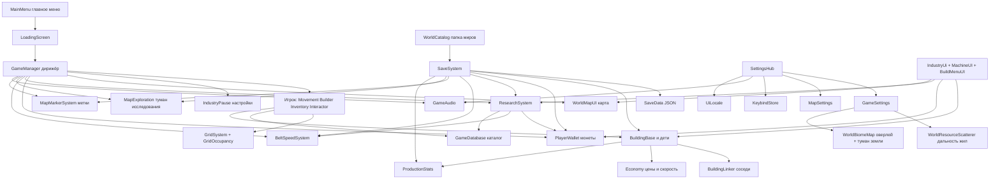

# Как устроена игра целиком

Представь завод и прогулку одновременно.

Ты — человечек на местности. Мир нарезан на **клетки** (как шахматная доска). Здания занимают клетки. Предметы едут из добычи в станки и в лабораторию.

Ниже — главные «отделы фирмы» и кто кому звонит.

## Жизненный цикл одной игровой сессии

1. [[MainMenu]] показывает список миров из [[WorldCatalog]].
2. Ты жмёшь «Играть» → сцена [[LoadingScreen]] → сцена мира.
3. [[GameManager]] просыпается и **на всякий случай вешает на себя** карту, кошелёк, статистику, ленты, метки, исследование карты, HUD.
4. [[SaveSystem]] читает `save.json` этого мира (если файл есть) и восстанавливает здания, игрока, деньги, исследования.
5. Каждый кадр: игрок ходит, станки крафтят, ленты двигают предметы, карта рисует туман исследования вокруг тебя.
6. Автосейв раз в ~2 минуты, плюс сейв при паузе/выходе.

## Деньги — короткий круговорот

1. [[Extractor]] / насосы достают сырьё с [[ResourceNode]].
2. [[CrafterBuilding]] превращает сырьё в детали по [[RecipeData]].
3. Лишние предметы (или специально сданные) попадают в [[ResearchLab]].
4. [[ResearchSystem]] сначала кормит текущее исследование. Остаток шестерёнок копится в [[BeltSpeedSystem]]. Остальное продаётся через [[Economy.SellValue]] в [[PlayerWallet]].
5. Монеты тратятся на постройку (`[[Economy.BuildCost]]`) и на кнопку апгрейда лент.

## Как предмет едет

1. Здание кладёт предмет в выход или сразу в соседа.
2. [[BuildingLinker]] знает, какая клетка перед сокетом.
3. [[Conveyor]] везёт предмет вдоль ленты с того входа, откуда он заехал (скорость × множитель [[BeltSpeedSystem]]). Форма (прямой / угол / T / бока / три входа) сама по соседям.
4. На конце ленты сосед принимает предмет (`TryReceiveItem`).

## Настройки — два сундука

- **Управление** живёт в PlayerPrefs как JSON переназначений клавиш ([[KeybindStore]]).
- **Графика / звук / карта** — отдельные ключи PlayerPrefs ([[GameSettings]], [[MapSettings]], [[GameAudio]], [[UiLocale]]).

Это не файлы мира: сменил яркость — она для всех миров. А метки и исследованная карта — **внутри сейва мира**.

## Что сознательно «не доделано» в коде

- [[PowerGenerator]] принимает топливо и считает таймер, но другие здания от него почти не зависят.
- Часть ТЗ карты (пещеры, радар мобов, мультиплеер) в коде нет — игра одиночная, без мобов и этажей.

Связанные обзоры: [[00_Index]], [[Папки_и_ассеты]], [[SaveData]].
